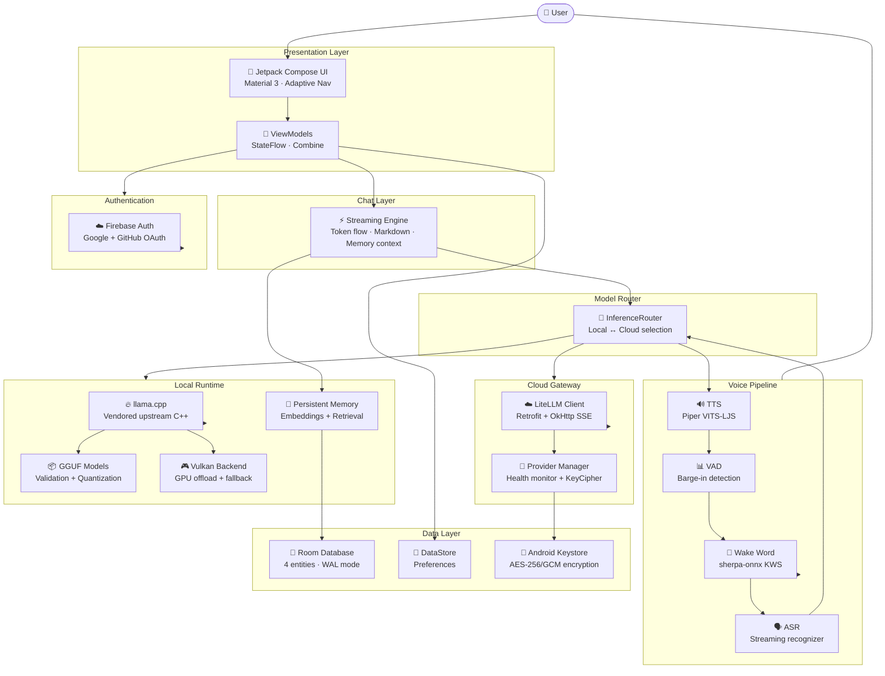

# AndroLLM

### Private AI. Native Android. Your Models. Your Choice.

A production-grade AI platform for Android that brings local GGUF model inference, GPU acceleration, cloud provider integration, persistent memory, and hands-free voice interaction into one unified application.

---

<p align="center">
  
</p>

<p align="center">
  <strong>Run powerful language models directly on your device.</strong><br/>
  Zero cloud dependency. Zero data leaves your phone — unless you choose otherwise.
</p>

<p align="center">
  <a href="#-features"><strong>Features</strong></a> ·
  <a href="#-ai-agent"><strong>AI Agent</strong></a> ·
  <a href="#-architecture"><strong>Architecture</strong></a> ·
  <a href="#-getting-started"><strong>Getting Started</strong></a> ·
  <a href="#-voice-assistant"><strong>Voice</strong></a> ·
  <a href="#-cloud-providers"><strong>Cloud</strong></a> ·
  <a href="#-memory"><strong>Memory</strong></a> ·
  <a href="#-documentation"><strong>Docs</strong></a> ·
  <a href="#-contributing"><strong>Contributing</strong></a>
</p>

<p align="center">
  
  
  
  
  
</p>

<p align="center">
  
  
  
  
  
  
</p>

---

## ✨ What Makes AndroLLM Different

Most mobile AI apps either route everything through the cloud or ship as a lightweight demo. **AndroLLM is a complete, production-quality product**:

| | Typical Mobile AI Apps | AndroLLM |
|---|---|---|
| **Local LLMs** | None or limited experiments | Full llama.cpp + GGUF support |
| **GPU Acceleration** | Rarely available | Vulkan offloading with CPU fallback |
| **Multi-turn Chat** | None or re-prefill every turn | KV-cache persistence, diff-based continuation |
| **Cloud Providers** | One proprietary backend | Any LiteLLM-compatible endpoint |
| **Persistent Memory** | None | Vector embeddings + hybrid retrieval |
| **Voice Assistant** | Cloud-dependent | Fully offline: wake word → ASR → LLM → TTS |
| **Your Data** | Sent to provider servers | Stays on-device by default |

---

## 🧠 Features

<table>
<tr>
<td width="50%">

### ⚡ Local Inference Engine

Run GGUF language models entirely on-device through a **vendored llama.cpp** build. No internet required after model download.

- Full C++ llama.cpp engine with JNI bridge (~3,700 lines)
- GGUF validation and memory estimation before load
- Streaming token output at up to 60 fps
- Multi-turn conversations via KV-cache persistence
- JSON and constrained decoding support
- Automatic context shift when approaching limits

</td>
<td width="50%">

### 🎮 Vulkan GPU Acceleration

Compile-ready Vulkan backend for hardware-accelerated inference on supported devices.

- Shader compilation at build time (host Vulkan SDK required)
- Runtime GPU-vs-CPU correctness validation
- Automatic fallback to ARM64 NEON + KleidiAI microkernels
- Corruption recovery: NaN/INF logits, invalid tokens, device-lost escalation
- Real-time diagnostics: `gpuFree`, `gpuTotal`, `recoveryCount`

</td>
</tr>
<tr>
<td width="50%">

### ☁️ Cloud Provider Integration

Connect to any OpenAI-compatible API through a unified LiteLLM proxy layer.

- Google Gemini · Anthropic Claude · OpenAI GPT · xAI Grok · Meta Llama
- Encrypted API keys via Android Keystore (AES-256/GCM)
- SSE streaming with exponential backoff retry (IOException, 408, 429, 5xx)
- Automatic health monitoring and provider failover
- Model discovery via `/v1/models` endpoint
- Custom providers with per-model overrides

</td>
<td width="50%">

### 🧩 Persistent Memory

Remember facts across conversations — locally or via cloud embeddings.

- SQLite-backed storage with in-memory vector index
- Hybrid search: cosine similarity + keyword matching
- Automatic extraction of preferences, facts, projects, opinions
- Model-independent: memories work with any loaded model
- Background indexing via WorkManager
- Full privacy: data stays on device unless cloud embedding is enabled

</td>
</tr>
<tr>
<td width="50%">

### 🎙️ Offline Voice Assistant

Hands-free interaction entirely on-device. Say **"Hey Andro"** and chat naturally.

- Wake word: sherpa-onnx KWS zipformer2 (~3 MB)
- Speech recognition: sherpa-onnx streaming ASR en-20M (~8 MB)
- Text-to-speech: Piper VITS-LJSpeech (~114 MB, lazy-loaded)
- Energy-based VAD for barge-in detection
- 12 local voice commands (mute, settings, new chat, etc.)
- Foreground service with system overlay and persistent notification

</td>
<td width="50%">

### 💎 Premium UI / UX

"The Parchment Ledger" design system — warm, editorial, calm.

- Jetpack Compose with Material 3
- Adaptive navigation: bottom bar (phone) → rail (tablet/foldable)
- Real-time markdown rendering with syntax-highlighted code blocks
- Streaming text at ~60 fps with stable item callbacks
- Light & dark themes with terracotta accent (`#D97757`)
- Conversation drawer, model parameter sheet, search overlay

</td>
</tr>
<tr>
<td width="50%">

### 🤖 AI Agent Platform

Understand, plan, and execute multi-step tasks through a capability-based tool system.

- 45+ built-in tools: weather, web search, SMS, calls, email, calendar, alarms, notes, calculator, converters, PDF/Markdown export, GitHub, QR & more
- Multi-round **plan → execute → re-plan** workflow engine with variables & conditionals
- Safety gates: per-tool permission toggles + high-risk confirmations (chat card & spoken voice)
- Contact-name resolution for messaging ("text Mom") and multipart SMS
- Effectively **unlimited answer length** — generation runs until the model finishes

</td>
<td width="50%">

### 🧩 MCP & UI Automation

Connect external MCP servers or drive third-party apps directly.

- **MCP (Streamable HTTP)** server import — remote tools become `mcp_<server>_<tool>`
- **Accessibility engine**: read screens, tap, type, scroll, drag, swipe, pinch
- Multi-step app tasks (`ui_run`) with LLM or heuristic step planning
- QR scanning, screenshot, share, and media control tools
- Strict confirmations for anything that sends, pays, books or deletes

</td>
</tr>
</table>

---

## 🏗️ Architecture



---

## 📦 Technology Stack

<p align="center">
  
</p>

<p align="center">
  
</p>

<p align="center">
  
</p>

| Layer | Technology | Purpose |
|---|---|---|
| **Language** | Kotlin 2.1.20 | Primary development language |
| **UI Framework** | Jetpack Compose 1.7.2 + Material 3 | Declarative, modern Android UI |
| **Architecture** | MVVM + Clean Architecture + Repository Pattern | Separation of concerns |
| **DI Container** | Hilt (Dagger) 2.57.1 | Compile-time dependency injection |
| **Navigation** | Navigation Compose 2.8.4 | Type-safe screen routing |
| **Async** | Kotlin Coroutines 1.8.0 + Flow | Structured concurrency |
| **Database** | Room 2.8.4 (WAL mode, v5 schema) | Local SQL persistence |
| **Preferences** | DataStore Preferences 1.1.1 | Reactive key-value storage |
| **Inference Engine** | llama.cpp (vendored, stock upstream) | Local GGUF model execution |
| **GPU Backend** | ggml Vulkan (build-time enabled) | Hardware-accelerated inference |
| **Voice Stack** | sherpa-onnx 1.13.4 (ONNX Runtime Mobile) | ASR, TTS, KWS, VAD |
| **Networking** | Ktor 3.0.3 + Retrofit + OkHttp 4.12.0 | HTTP client for downloads & APIs |
| **Auth** | Firebase Auth 34.12.0 | Google Sign-In + GitHub OAuth |
| **Secrets** | Android Keystore (AES-256/GCM) | API key encryption |
| **Logging** | Timber 5.0.1 | Structured logging |
| **Testing** | JUnit 4 · mockk · Turbine · Espresso | 51 test classes across 19 modules |
| **Code Quality** | Spotless · Detekt | Formatting + static analysis |

---

## 🔧 Getting Started

### Prerequisites

| Requirement | Minimum | Recommended |
|---|---|---|
| Android Studio | Hedgehog (2023.1.1) | Latest stable |
| JDK | 17 | 17 (auto-managed by Gradle) |
| Android SDK | API 34 | API 34 |
| NDK | r26 (26.1.10909125) | r26 |
| CMake | 3.22.1+ | Bundled with Android Studio |
| Vulkan SDK | Latest | For host-side shader compilation |

### Build & Install

```bash
# Clone the repository
git clone https://github.com/ShadowSafin/AndroLLM.git
cd AndroLLM

# Build debug APK
./gradlew assembleDebug

# Install on connected device
adb install app/build/outputs/apk/debug/app-debug.apk
```

📖 [Full Building Guide](documentation/BUILDING.md) · [Development Workflow](documentation/DEVELOPMENT.md)

### First Run

1. **Install** the APK on an arm64-v8a device (8 GB+ RAM recommended)
2. **Sign in** with Google or GitHub (optional — guest mode works fully)
3. **Browse models** in the Catalog tab — filters by your device's RAM
4. **Download and load** a model (Qwen2.5-1.5B-Q4_K_M is a good starting point)
5. **Start chatting** — messages stream in real-time with markdown rendering
6. **Enable voice** in Settings → Voice Assistant and say "Hey Andro"
7. **Unlock the agent** — enable Tool Calling in Settings → Automation and try a multi-step request

---

## 🎙️ Voice Assistant

Complete offline voice pipeline — no internet required:

```
[Microphone @ 16kHz]
       │
       ▼
  Wake Word Detection
  "Hey Andro" / "Okay Andro"
  (sherpa-onnx KWS, ~3 MB)
       │
       ▼
  Streaming ASR
  English speech → text
  (zipformer-en-20M int8, ~8 MB)
       │
       ▼
  Command Router ───► 12 local commands
       │
       ▼
  LLM Generation ───► Local GGUF or Cloud API
       │
       ▼
  TTS Playback
  Piper VITS-LJS @ 22050Hz
  (~114 MB, lazy-loaded)
       │
       ▼
  Barge-in via VAD ──► Interrupt and re-listen
```

**Supported voice commands:** mute, unmute, stop speaking, new chat, open settings,
open models, switch theme, delete conversation, summarize chat, enable/disable offline
mode and voice.

### Voice + Agent

- **Spoken confirmations** — for high-risk actions the assistant asks aloud
  ("*send the SMS to Mom?*") and listens for yes/no
- **Multi-step spoken tasks** — voice runs the same tool workflow as chat
- **Smart TTS** — LLM output is normalized before speaking: numbers, dates,
  currencies, units, math, emoji, URLs, phones, and out-of-lexicon words
  ("LLM" → "el el em") are all pronounced correctly; each stage is
  configurable in Settings → Text Normalization

📖 [Voice Architecture](documentation/voice/voice-assistant.md) · [Text Normalization](documentation/voice/text-normalization.md)

---

## 🤖 AI Agent

Beyond chat, AndroLLM is a full **on-device AI agent**. Enable it in
**Settings → Automation → Tool Calling**, then ask for multi-step tasks:

> *"Check today's weather and text Mom if it will rain"*
> *"Search GitHub for LiteLLM and summarize the latest release"*
> *"Turn on Bluetooth, connect my earbuds, then play my workout playlist"*

### How it works

```
Your request
     │
     ▼
  PLANNER ─── local GGUF (JSON-grammar) ── or ── cloud (native tool calls)
     │  picks tools + arguments
     ▼
  EXECUTOR ── permission gate → confirmation gate → timeout (20 s)
     │  (the only place tool code runs)
     ▼
  TOOLS ── 45+ built-ins · accessibility · MCP remote tools
     │
     ▼
  RESULTS feed back → re-plan (up to 6 rounds) → grounded final answer
```

### Capabilities

| Capability | Highlights |
|---|---|
| **Tool catalog** | Weather, search, SMS/calls/email (confirmed), calendar, alarms, reminders, clipboard, notes, files, calculator, unit & currency converters, translation, GitHub, media, PDF/Markdown export, QR, and more — [full catalog](documentation/agent/tools.md) |
| **Workflow engine** | Multi-round plan→execute→re-plan, IF/ELSE & loops via `variable_set`/`variable_get`, live device context (battery, time, clipboard, app) injected every round — [details](documentation/agent/workflow-engine.md) |
| **Confirmations** | High-risk actions ask first — chat card **and** spoken voice question; modes: High-risk / Always / Never — [details](documentation/agent/agent-platform.md) |
| **MCP servers** | Import tools from any MCP (Streamable HTTP) server; they become first-class `mcp_<server>_<tool>` capabilities — [details](documentation/agent/mcp.md) |
| **UI automation** | Drive any app via the accessibility service: tap, type, scroll, swipe, pinch, multi-step tasks — [details](documentation/agent/accessibility-automation.md) |
| **Transparency** | Every call is trace-logged (Developer → Tool Debug); tools never run silently; retry-once on transient failures |

---

## ☁️ Cloud Providers

Add any LiteLLM-compatible endpoint from Settings → Cloud Providers:

| Provider | Status | Notes |
|---|---|---|
| Google Gemini | ✅ Supported | Via LiteLLM proxy |
| Anthropic Claude | ✅ Supported | Via LiteLLM proxy |
| OpenAI GPT | ✅ Supported | Native OpenAI API |
| xAI Grok | ✅ Supported | OpenAI-compatible endpoint |
| Meta Llama | ✅ Supported | Via self-hosted LiteLLM |
| Mistral | ✅ Supported | OpenAI-compatible API |
| Custom LiteLLM | ✅ Supported | Any OpenAI-compatible router |

API keys are encrypted with **AES-256/GCM via Android Keystore** — they never touch shared preferences or plaintext storage.

📖 [Cloud Provider Architecture](documentation/cloud/cloud-providers.md)

---

## 🧠 Memory System

Memories extracted from conversations are stored locally and injected into future contexts:

```
Conversation exchange
        │
        ├──▶ Extract facts & preferences
        │       (JSON schema: category, content, importance, tags)
        │
        ├──▶ Embed content
        │       ├── Cloud path: LiteLLM embeddings API
        │       └── Local path: dedicated llama.cpp embedding handle
        │
        ├──▶ Store in SQLite + CosineVectorIndex
        │
        └──▶ Future conversation:
                Hybrid search (vector + keyword)
                → Inject into system prompt
```

Works fully offline. Falls back to keyword/recency sorting when embeddings are unavailable.

📖 [Memory Architecture](documentation/memory/memory-architecture.md)

---

## 📊 Model Support

**Format:** GGUF (primary). The app validates headers before loading and supports 137
architectures including `llama`, `gemma2`, `qwen2`, `deepseek`, `mistral`, `phi3`, and more.

| Quantization | Bits | Use Case |
|---|---|---|
| Q8_0 | ~8 | Best quality · 8 GB+ RAM |
| **Q5_K_M** | ~5.5 | **Recommended balance** · 4–8 GB RAM |
| **Q4_K_M** | ~4.5 | **Sweet spot for mobile** · 2–4 GB RAM |
| IQ3_XS | ~3.25 | Very constrained · < 2 GB available |

📖 [Model Support Guide](documentation/MODEL_SUPPORT.md)

---

## 🔐 Privacy & Security

| Aspect | Implementation |
|---|---|
| **Local inference** | Runs entirely on-device; zero network transmission |
| **API key storage** | AES-256/GCM encrypted in Android Keystore |
| **Database** | Room in app-private sandbox (`/data/data/io.androllm.app/`) |
| **Network** | HTTPS-only; cleartext disabled (`usesCleartextTraffic=false`) |
| **Permissions** | Minimal set; requested lazily (not at launch) |
| **Voice audio** | Processed entirely on-device; no server transmission |
| **Analytics** | None. Zero telemetry or crash reporting services. |
| **Guest mode** | Full functionality without any authentication |

See [PRIVACY.md](PRIVACY.md) and [SECURITY.md](SECURITY.md) for full details.

---

## 📚 Documentation

| Document | Description |
|---|---|
| [ARCHITECTURE.md](documentation/ARCHITECTURE.md) | Complete system architecture with diagrams |
| [BUILDING.md](documentation/BUILDING.md) | Environment setup and build instructions |
| [CONTRIBUTING.md](CONTRIBUTING.md) | Development guidelines and code style |
| [TESTING.md](documentation/TESTING.md) | Test strategy, frameworks, and conventions |
| [DEVELOPMENT.md](documentation/DEVELOPMENT.md) | IDE setup, debugging, profiling guide |
| [TROUBLESHOOTING.md](documentation/TROUBLESHOOTING.md) | Common issues and solutions |
| [FAQ.md](documentation/FAQ.md) | Frequently asked questions |
| [PERFORMANCE.md](documentation/PERFORMANCE.md) | Token speed, RAM, Vulkan, battery guidance |
| [MODEL_SUPPORT.md](documentation/MODEL_SUPPORT.md) | GGUF formats, architectures, quantizations |
| [ROADMAP.md](documentation/ROADMAP.md) | Completed, planned, and future features |
| [CHANGELOG.md](documentation/CHANGELOG.md) | Version history |
| [RELEASE_PROCESS.md](documentation/RELEASE_PROCESS.md) | Build, sign, and publish procedures |
| [PROJECT_STRUCTURE.md](documentation/PROJECT_STRUCTURE.md) | 26-module dependency graph |

### Deep-Dive Documentation (`documentation/`)

```
documentation/
├── getting-started/first-run.md        # Installation and first-time setup
├── ai/                                 # AI engine internals
│   ├── llama-cpp.md                    # Native engine, JNI bridge, multi-turn strategy
│   ├── gguf.md                         # GGUF format specification and validation
│   └── vulkan.md                       # GPU acceleration and corruption recovery
├── voice/voice-assistant.md            # Full voice pipeline: KWS → ASR → TTS
├── voice/text-normalization.md         # TTS text normalization + OOV spelling
├── agent/                              # AI agent platform
│   ├── agent-platform.md               # Planning, executor safety gates, chat/voice
│   ├── tools.md                        # Complete built-in tool catalog
│   ├── workflow-engine.md              # Multi-step execution, variables, confirmations
│   ├── mcp.md                          # MCP server integration
│   └── accessibility-automation.md     # UI automation, gestures, planners
├── cloud/cloud-providers.md            # LiteLLM client, streaming, security
├── memory/memory-architecture.md       # Embeddings, retrieval, vector index
├── ui/                                 # UI architecture
│   ├── ui-architecture.md              # Design system, components, theming
│   └── chat-architecture.md            # Streaming, markdown, state management
├── backend/                            # Data layer
│   ├── database.md                     # Room schema v5, migrations, DAOs
│   ├── networking.md                   # Ktor + Retrofit stacks
│   └── firebase-auth.md                # Google + GitHub auth flow
├── security/security-architecture.md   # 4-layer security model
├── development/error-handling.md       # Result/UiState patterns, recovery
├── android/permissions.md              # All declared permissions reference
└── INDEX.md                            # Complete documentation index
```

---

## 🛠️ Project Structure

**26 Gradle modules** organized into three tiers:

```
AndroLLM/
├── app/                          # Entry point, navigation host, auth
├── core/                         # 15 shared library modules
│   ├── common/      Base types (Result, UiState, BaseViewModel)
│   ├── ui/          Compose theme, design system, shared components
│   ├── database/    Room DB (4 entities, version 5, WAL mode)
│   ├── datastore/   Preferences DataStore
│   ├── navigation/  Route constants and extensions
│   ├── models/      Domain models + catalog engine (137 architectures)
│   ├── network/     Ktor client + HuggingFace API
│   ├── cloud/       LiteLLM client + provider manager + KeyCipher
│   ├── utils/       Permissions, storage, connectivity helpers
│   ├── telemetry/   Performance metrics storage
│   ├── memory/      Vector memory system with embeddings
│   ├── voice/       sherpa-onnx ASR/TTS/KWS/VAD engines
│   ├── tools/       AI agent: planner, executor, registry, workflow, traces
│   ├── mcp/         MCP client: connection manager + remote tool adapter
│   └── accessibility/ UI automation service, gestures, QR scanning
├── engine/                       # llama.cpp native engine + JNI bridge
│   ├── cpp/native_api.cpp        ~3,700 lines JNI bridge
│   └── cpp/llama.cpp/            Vendored stock upstream llama.cpp
├── feature/                      # 11 independent feature modules
│   ├── home/    Home screen, recent chats, quick actions
│   ├── chat/    Chat UI, streaming, markdown, drawer
│   ├── models/  Model catalog browser, downloader, benchmark
│   ├── voice/   Foreground service, overlay UI, state machine
│   ├── settings/ App settings, voice config, memory controls
│   ├── splash/  Animated splash screen
│   ├── onboarding/ First-run onboarding flow
│   ├── profile/ User profile with Firebase sync
│   ├── prompts/ Prompt library
│   ├── developer/ Developer tools and diagnostics
│   └── cloud/   Cloud provider management and model browsing
├── documentation/               # Internal documentation module
└── gradle/libs.versions.toml     # Centralized version catalog
```

Feature modules depend **only** on `core:*` modules — never on each other.

---

## 🚧 Roadmap Highlights

| Status | Feature |
|---|---|
| ✅ | llama.cpp native engine with Vulkan backend |
| ✅ | GGUF model catalog with 137 architecture support |
| ✅ | Cloud provider abstraction via LiteLLM |
| ✅ | Persistent memory with vector embeddings |
| ✅ | Offline voice assistant (wake word → ASR → TTS) |
| ✅ | Firebase Auth (Google + GitHub) |
| ✅ | 51 test classes across 19 modules |
| ✅ | AI agent platform (45+ tools, workflow engine, confirmations) |
| ✅ | MCP server integration (Streamable HTTP) |
| ✅ | Accessibility UI automation (gestures, multi-step app tasks) |
| ✅ | Voice confirmations + TTS text normalization |
| 🚧 | Multi-language ASR (Chinese, Japanese, Korean) |
| 🚧 | CI/CD pipeline |
| 🔮 | QNN/NPU backend (Snapdragon) |
| 🔮 | Multi-modal vision models |

See [ROADMAP.md](documentation/ROADMAP.md) for the full list.

---

## 🤝 Contributing

We welcome contributions of all kinds — bug reports, documentation fixes, new features.

📖 [Contributing Guide](CONTRIBUTING.md)

---

## 📄 License

This project is licensed under the Apache License 2.0. See [LICENSE](LICENSE.md) for details.
Third-party component licenses are listed in [LICENSES.md](LICENSES.md).

---

## 🔗 References

- [llama.cpp](https://github.com/ggerganov/llama.cpp) — Local LLM inference engine
- [sherpa-onnx](https://k2-fsa.github.io/sherpa/onnx/) — Offline voice processing
- [Jetpack Compose](https://developer.android.com/jetpack/compose) — Modern Android UI
- [Material 3](https://m3.material.io/) — Design system
- [Firebase Auth](https://firebase.google.com/docs/auth) — Authentication
- [LiteLLM](https://litellm.vercel.app/) — Cloud provider abstraction
- [Android Keystore](https://developer.android.com/privacy-and-security/keystore) — Secure key storage
